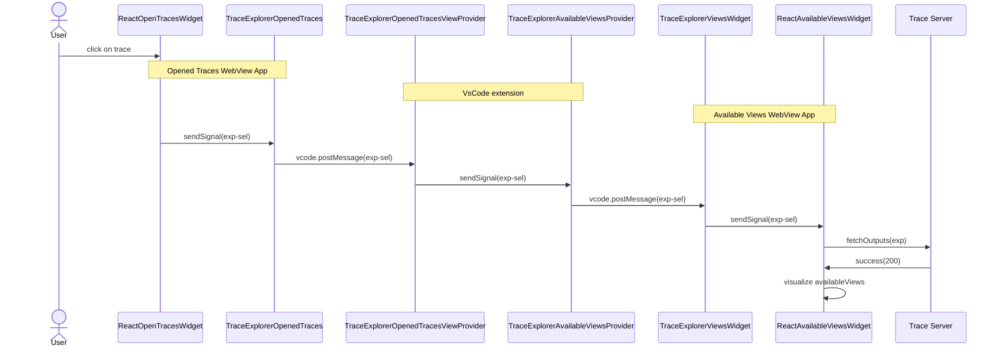

# VSCode Trace Extension

This project started from the [vscode webview react project][vscode-webview-react]. It works this way, with the extension itself being in the `vscode-trace-extension` directory and the react application being in the `vscode-trace-webapps` directory.

## Installation instructions

The code was migrated from the [PR in theia-trace-extension][init-contrib].

It depends on the trace viewer plugins from the [theia trace extension package][theia-trace] and the [tsp typescript client][tsp-client], as well as the [timeline chart][timeline-chart]. They are all available from the NPM package registry.

- timeline-chart
- traceviewer-base
- traceviewer-react-components
- tsp-typescript-client

To build the vscode extension, run the `yarn` command:

``` bash
yarn
```

## Running the extension

Then from vscode, press `f5` to run the extension. The trace server needs to be started separately as described [here](#run-the-trace-server).

To open a trace use the VSCode file explorer to navigate to the trace directory. Then right mouse click on the trace and select menu option `Open with Trace Viewer`. See [here](#get-sample-traces) to get some sample traces.

Open the `Trace Viewer` view (`View` -> `Open view...`).

![open-trace][open-trace]

2 tabs will be visible: `Traces` and `Views`. The `Traces` tab will show all available traces on the trace server.

The `Views` tab shows all the available views for the selected trace. Click on a view to open the view under the timeline.

![open-output][open-output]

## Package as VsCode extension

To package it as VsCode extension, run the command `yarn vsce:package`. If you get errors about case-sensitive files, just delete the node_modules folder and run `yarn` again.

The packaging will produce a `vscode-trace-extension-x.x.x.vsix` file in the subdirectory `vscode-trace-extension` of the repo.

## Running the extension in VsCode, VsCodium or Theia application

The packaged VSIX file can be installed in an existing `VsCode`, `VsCodium` or `Theia` application by using [Install from a vsix][install].

The trace server needs to be started separately as described [here](#run-the-trace-server).

## Running the extension in the Theia Trace Viewer example app

The packaged VSIX file can be run in the example app of the [theia-trace-extension][theia-trace]. For this the file can be can be symlinked in the `plugins` of the example app of `theia-trace-extension` repo.

``` bash
cd <theia-trace-extension root>/examples/plugins
ln -s <vscode-trace-extension root>/vscode-trace-extension-x.x.x.vsix ./
```

## Developing the extension

When having to modify the code of the extension (in the `vscode-trace-extension` folder), one can simply run the `yarn` command. It is also possible to watch for changes to have no manual steps to do before re-running the extension: `yarn watch` or `ctrl-shift-b` and select the task `npm: watch - vscode-trace-extension`.

For changes in the webview part (in the `vscode-trace-webviews` folder), you can run the `yarn` command, simply re-opening a trace should show the changes. It is also possible to watch for changes with `yarn watch` or `ctrl-shift-b` and selecting the task `npm: watch - vscode-trace-webviews`.

For more information about `VsCode WebView API` see [here][vscode-webview].

### Communication between components

To communicate between VsCode extension and webviews use the [VsCode message API][vscode-messages]. When using `vscode.postMessage(data)` data structure `data` will be serialized to JSON before being propagated. Be aware that it cannot include data structures like `BigInt`. Proper handling of such data structures need to be implemented when sending and receiving messages.

Inside a webview or inside the extension signals can be used where data structures can be passed on.

The following sequence diagram shows how the `experiment-selected` signal (with payload `Experiment`) is propagated inside the application. The webview `Opened Traces WebView App` is sending the signal to the`VsCode extension` which is forwarding the signal to the `Available Views WebView App`.



### Debugging the extension

It is straightforward to debug the code of the vscode extension itself (the code in `vscode-trace-extension`) by just putting breakpoints in vscode and running the extension with `f5`.

The react-app is another matter. The panel is a webview that is running in its own context, so current vscode does not have access to it. _(Patches welcome!)_

Each panel is its own small web application, so to debug, while in the context of the webview, press `ctrl-shift-p` and enter the command `Developer: Open Webview Developer Tools`. This will open the developer tools. The code is in the `Sources` tab of the developer tools window that opens.

### Troubleshooting

*The `Trace Viewer` panel is not there, or disappears when switching panel.

Right-click on the vscode activity bar and make sure `Trace Viewer` is checked.

![trace-explorer-activity-bar][trace-explorer-activity-bar]

## Run the Trace Server

In order to open traces, you need a trace server running on the same machine as the trace extension. You can download the [Eclipse Trace Compass server][tc-server] or let `yarn` download and run it:

```bash
yarn download:server
yarn start:server
```

You can also build the trace-server yourself using Trace Compass and the Incubator. Take a look at the [instructions here][tc-server-build].

## Get sample traces

To get sample traces to try run the following command. The traces will be stored under the subdirectory `TraceCompassTutorialTraces` of the repo.

```bash
yarn download:sample-traces
```

[init-contrib]: https://github.com/eclipse-cdt-cloud/theia-trace-extension/pull/124
[install]: https://code.visualstudio.com/docs/editor/extension-marketplace#_install-from-a-vsix
[open-output]: https://raw.githubusercontent.com/theia-ide/vscode-trace-extension/master/doc/images/vscode-trace-extension-001.png
[open-trace]: https://raw.githubusercontent.com/theia-ide/vscode-trace-extension/master/doc/images/vscode-open-with-trace-viewer-001.png
[theia-trace]: https://github.com/eclipse-cdt-cloud/theia-trace-extension/
[tc-server]: https://download.eclipse.org/tracecompass.incubator/trace-server/rcp/?d
[tc-server-build]: https://www.eclipse.org/tracecompass/download.html#trace-server
[timeline-chart]: https://github.com/eclipse-cdt-cloud/timeline-chart/
[trace-explorer-activity-bar]: https://raw.githubusercontent.com/theia-ide/vscode-trace-extension/master/doc/images/vscode-show-trace-viewer-001.png
[tsp-client]: https://github.com/eclipse-cdt-cloud/tsp-typescript-client/
[vscode-messages]: https://code.visualstudio.com/api/extension-guides/webview#passing-messages-from-an-extension-to-a-webview
[vscode-webview]: https://github.com/rebornix/vscode-webview-react
[vscode-webview-react]: https://github.com/rebornix/vscode-webview-react
